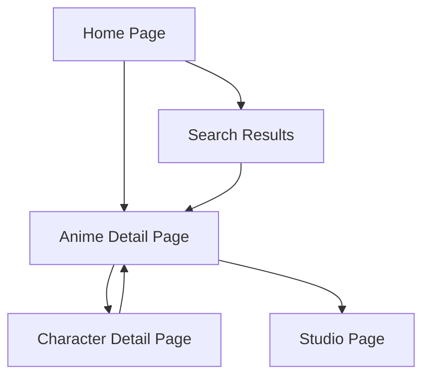

## 1. Product Overview
An anime encyclopedia website where users can browse, search, and read detailed information about anime series, characters, and studios. The platform serves anime enthusiasts who want comprehensive information about their favorite series, characters, and production studios in one centralized location.

## 2. Core Features

### 2.1 User Roles
| Role | Registration Method | Core Permissions |
|------|---------------------|------------------|
| Visitor | No registration required | Browse all content, search anime, view details, bookmark locally |

### 2.2 Feature Module
Our anime wiki requirements consist of the following main pages:
1. **Home page**: hero banner with featured anime, search functionality, category filters, anime card grid
2. **Anime detail page**: comprehensive anime information, character listings, related anime
3. **Character detail page**: character profiles and anime appearances
4. **Search results page**: filtered search results with sorting options
5. **Studio page**: studio information and produced anime list

### 2.3 Page Details
| Page Name | Module Name | Feature description |
|-----------|-------------|---------------------|
| Home page | Hero banner | Display featured/trending anime with cover images and titles |
| Home page | Search bar | Search anime by title, genre, or studio with real-time suggestions |
| Home page | Category filters | Filter tabs for genres: All, Action, Romance, Fantasy, Sci-Fi, Slice of Life |
| Home page | Anime grid | Display anime cards with cover image, title, score, episode count, and status |
| Anime detail | Header section | Show cover image, banner, Japanese and English titles, score, status, episodes, season, studio, genres |
| Anime detail | Synopsis | Display detailed anime description and plot summary |
| Anime detail | Character list | Show character avatars with names and roles (Main/Supporting) |
| Anime detail | Related anime | Display related or similar anime recommendations |
| Character detail | Profile header | Show character image, name, age, and role information |
| Character detail | Description | Display character biography and background information |
| Character detail | Anime appearances | List all anime where character appears |
| Search results | Filters | Filter by genre, status, score range, and year |
| Search results | Sorting | Sort results by score, popularity, or newest |
| Search results | Results grid | Display filtered anime cards with pagination |
| Studio page | Studio info | Display studio logo, name, and description |
| Studio page | Anime list | Show all anime produced by the studio |

## 3. Core Process
Users can browse the homepage to discover anime through the hero banner and category filters. They can search for specific anime using the search bar, which takes them to search results. From search results or the homepage, users can click on anime cards to view detailed information including characters and related anime. Users can also navigate to character details to learn more about specific characters and their appearances across different anime. Studio pages provide information about animation studios and their productions.

## 4. User Interface Design

### 4.1 Design Style
- **Primary colors**: Dark navy (#0f172a) and deep purple (#581c87)
- **Secondary colors**: Purple accents (#7c3aed) and dark grays (#1f2937)
- **Button style**: Rounded corners with hover effects and smooth transitions
- **Font**: Modern sans-serif (Inter or similar) with responsive sizing
- **Layout style**: Card-based grid layout with top navigation
- **Icon style**: Minimalist line icons with consistent stroke width

### 4.2 Page Design Overview
| Page Name | Module Name | UI Elements |
|-----------|-------------|-------------|
| Home page | Hero banner | Full-width carousel with anime covers, gradient overlays, animated transitions every 5 seconds |
| Home page | Search bar | Centered input with purple border, search icon, autocomplete dropdown |
| Home page | Category tabs | Horizontal scrollable tabs with active state highlighting, smooth hover animations |
| Home page | Anime cards | 4-column grid on desktop, 2-column on tablet, 1-column on mobile, hover scale effect, shadow elevation |
| Anime detail | Header | Full-width banner with gradient overlay, cover image positioned overlapping, rating badge |
| Anime detail | Info sections | Card-based sections with consistent spacing, collapsible synopsis, character avatar circles |
| Character detail | Profile | Circular character image, name in large font, role badge with color coding |
| Search results | Filters | Sidebar on desktop, modal on mobile, range sliders for scores, multi-select chips for genres |

### 4.3 Responsiveness
Desktop-first design approach with mobile adaptation. Touch interaction optimization for mobile devices with larger tap targets and swipe gestures for carousels. Responsive breakpoints at 640px (mobile), 768px (tablet), and 1024px (desktop).

### 4.4 Additional Features
- **404 page**: Custom anime-themed error page with search suggestion
- **Breadcrumb navigation**: Hierarchical navigation showing current page location
- **Back to top button**: Floating button appearing after scroll with smooth scroll animation
- **Favorites system**: LocalStorage-based bookmarking with heart icon toggle on anime cards