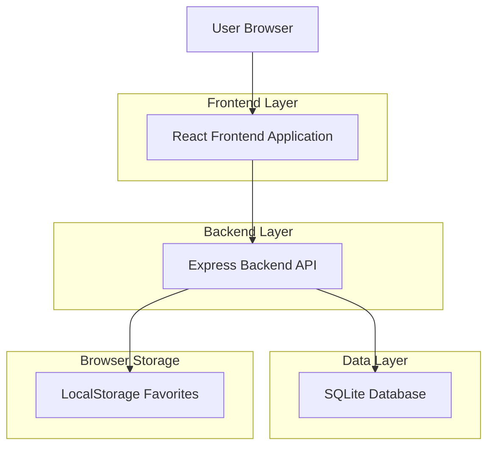
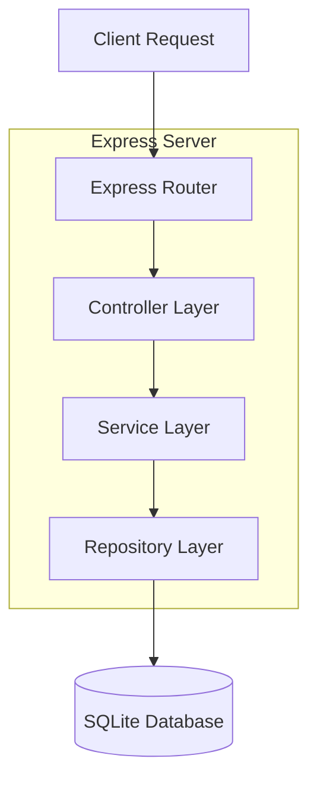
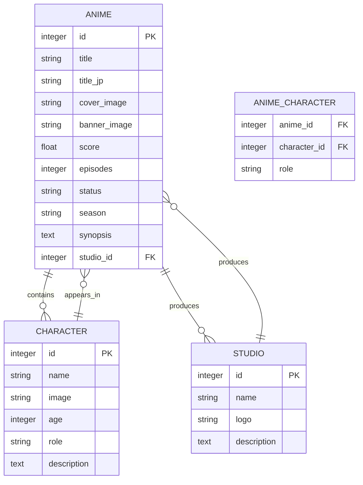

## 1. Architecture design



## 2. Technology Description
- Frontend: React@18 + TypeScript + Tailwind CSS
- Initialization Tool: vite-init
- Backend: Node.js + Express
- Database: SQLite
- Deployment: Vercel

## 3. Route definitions
| Route | Purpose |
|-------|---------|
| / | Home page with hero banner, search, and anime grid |
| /anime/:id | Anime detail page with comprehensive information |
| /character/:id | Character detail page with profile and appearances |
| /search | Search results page with filters and sorting |
| /studio/:id | Studio page with information and anime list |
| /404 | Error page for non-existent routes |

## 4. API definitions

### 4.1 Core API Endpoints

**Get all anime with pagination**
```
GET /api/anime?page=1&limit=20&genre=Action&status=Ongoing&sort=score
```

Request Query Parameters:
| Param Name | Param Type | isRequired | Description |
|------------|-------------|-------------|-------------|
| page | number | false | Page number for pagination (default: 1) |
| limit | number | false | Items per page (default: 20) |
| genre | string | false | Filter by genre |
| status | string | false | Filter by status (Ongoing/Finished) |
| sort | string | false | Sort by score/popularity/newest |

Response:
```json
{
  "data": [
    {
      "id": 1,
      "title": "Attack on Titan",
      "title_jp": "進撃の巨人",
      "cover_image": "https://example.com/cover.jpg",
      "score": 9.0,
      "episodes": 75,
      "status": "Finished",
      "genres": ["Action", "Drama", "Fantasy"]
    }
  ],
  "total": 100,
  "page": 1,
  "limit": 20
}
```

**Get anime by ID**
```
GET /api/anime/:id
```

Response:
```json
{
  "id": 1,
  "title": "Attack on Titan",
  "title_jp": "進撃の巨人",
  "cover_image": "https://example.com/cover.jpg",
  "banner_image": "https://example.com/banner.jpg",
  "score": 9.0,
  "episodes": 75,
  "status": "Finished",
  "season": "Spring 2013",
  "studio_id": 1,
  "studio_name": "Wit Studio",
  "genres": ["Action", "Drama", "Fantasy"],
  "synopsis": "Humanity fights for survival against giant humanoid Titans...",
  "characters": [
    {
      "id": 1,
      "name": "Eren Yeager",
      "image": "https://example.com/eren.jpg",
      "role": "Main"
    }
  ],
  "related_anime": [
    {
      "id": 2,
      "title": "Attack on Titan Season 2",
      "cover_image": "https://example.com/s2.jpg"
    }
  ]
}
```

**Get character by ID**
```
GET /api/character/:id
```

Response:
```json
{
  "id": 1,
  "name": "Eren Yeager",
  "image": "https://example.com/eren.jpg",
  "age": 19,
  "role": "Main",
  "description": "The protagonist who seeks freedom beyond the walls...",
  "appears_in": [
    {
      "id": 1,
      "title": "Attack on Titan",
      "cover_image": "https://example.com/cover.jpg"
    }
  ]
}
```

**Get studio by ID**
```
GET /api/studio/:id
```

Response:
```json
{
  "id": 1,
  "name": "Wit Studio",
  "logo": "https://example.com/wit-logo.png",
  "description": "Japanese animation studio founded in 2012...",
  "anime": [
    {
      "id": 1,
      "title": "Attack on Titan",
      "cover_image": "https://example.com/cover.jpg",
      "score": 9.0
    }
  ]
}
```

**Search anime**
```
GET /api/search?q=naruto&genre=Action&min_score=8&year=2020
```

Request Query Parameters:
| Param Name | Param Type | isRequired | Description |
|------------|-------------|-------------|-------------|
| q | string | true | Search query |
| genre | string | false | Filter by genre |
| min_score | number | false | Minimum score filter |
| max_score | number | false | Maximum score filter |
| year | number | false | Release year filter |

## 5. Server architecture diagram



## 6. Data model

### 6.1 Data model definition



### 6.2 Data Definition Language

**Anime Table**
```sql
CREATE TABLE anime (
  id INTEGER PRIMARY KEY AUTOINCREMENT,
  title TEXT NOT NULL,
  title_jp TEXT,
  cover_image TEXT NOT NULL,
  banner_image TEXT,
  score REAL DEFAULT 0,
  episodes INTEGER DEFAULT 0,
  status TEXT CHECK(status IN ('Ongoing', 'Finished', 'Upcoming')),
  season TEXT,
  synopsis TEXT,
  studio_id INTEGER,
  created_year INTEGER,
  FOREIGN KEY (studio_id) REFERENCES studio(id)
);

CREATE INDEX idx_anime_title ON anime(title);
CREATE INDEX idx_anime_score ON anime(score DESC);
CREATE INDEX idx_anime_status ON anime(status);
```

**Character Table**
```sql
CREATE TABLE characters (
  id INTEGER PRIMARY KEY AUTOINCREMENT,
  name TEXT NOT NULL,
  image TEXT,
  age INTEGER,
  role TEXT CHECK(role IN ('Main', 'Supporting')),
  description TEXT
);

CREATE INDEX idx_character_name ON characters(name);
```

**Studio Table**
```sql
CREATE TABLE studio (
  id INTEGER PRIMARY KEY AUTOINCREMENT,
  name TEXT NOT NULL,
  logo TEXT,
  description TEXT
);

CREATE INDEX idx_studio_name ON studio(name);
```

**Anime-Character Junction Table**
```sql
CREATE TABLE anime_characters (
  anime_id INTEGER,
  character_id INTEGER,
  role TEXT CHECK(role IN ('Main', 'Supporting')),
  PRIMARY KEY (anime_id, character_id),
  FOREIGN KEY (anime_id) REFERENCES anime(id),
  FOREIGN KEY (character_id) REFERENCES characters(id)
);

CREATE INDEX idx_anime_characters_anime ON anime_characters(anime_id);
CREATE INDEX idx_anime_characters_character ON anime_characters(character_id);
```

**Genres Table**
```sql
CREATE TABLE genres (
  id INTEGER PRIMARY KEY AUTOINCREMENT,
  name TEXT NOT NULL UNIQUE
);

CREATE TABLE anime_genres (
  anime_id INTEGER,
  genre_id INTEGER,
  PRIMARY KEY (anime_id, genre_id),
  FOREIGN KEY (anime_id) REFERENCES anime(id),
  FOREIGN KEY (genre_id) REFERENCES genres(id)
);
```

**Sample Seed Data**
```sql
-- Insert genres
INSERT INTO genres (name) VALUES 
('Action'), ('Adventure'), ('Comedy'), ('Drama'), ('Fantasy'),
('Romance'), ('Sci-Fi'), ('Slice of Life'), ('Supernatural'), ('Thriller');

-- Insert studios
INSERT INTO studio (name, logo, description) VALUES
('Wit Studio', 'wit-logo.png', 'Japanese animation studio known for Attack on Titan'),
('MAPPA', 'mappa-logo.png', 'Japanese animation studio founded in 2011'),
('Ufotable', 'ufotable-logo.png', 'Japanese animation studio known for Demon Slayer');

-- Insert sample anime
INSERT INTO anime (title, title_jp, cover_image, banner_image, score, episodes, status, season, synopsis, studio_id, created_year) VALUES
('Attack on Titan', '進撃の巨人', 'aot-cover.jpg', 'aot-banner.jpg', 9.0, 75, 'Finished', 'Spring 2013', 'Humanity fights for survival against giant humanoid Titans.', 1, 2013),
('Demon Slayer', '鬼滅の刃', 'ds-cover.jpg', 'ds-banner.jpg', 8.7, 26, 'Finished', 'Spring 2019', 'A young boy becomes a demon slayer to save his sister.', 3, 2019);
```